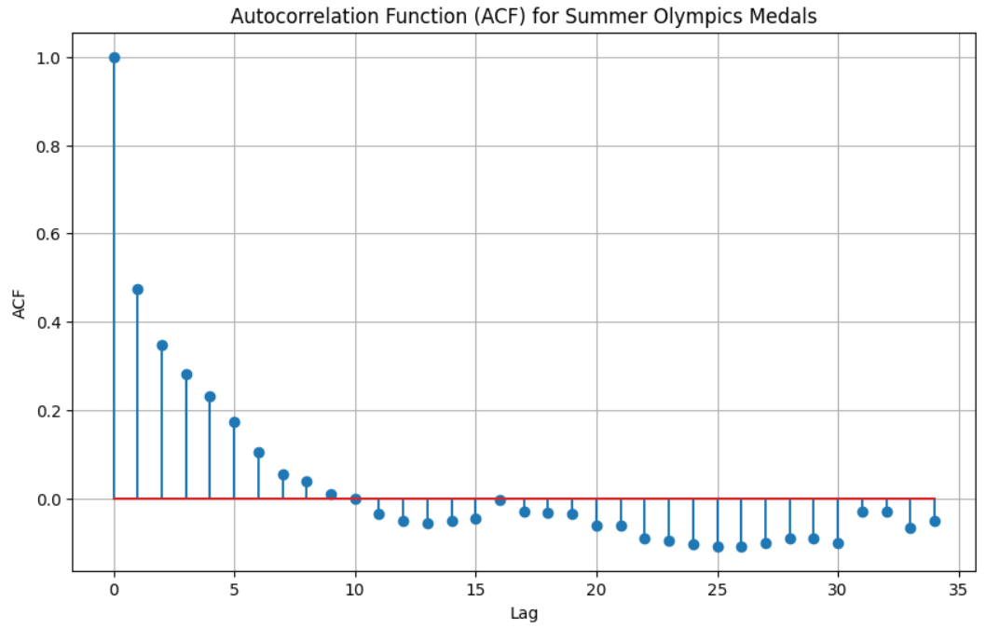

# Ex.No: 03   COMPUTE THE AUTO FUNCTION(ACF)
Date: 

### AIM:
To Compute the AutoCorrelation Function (ACF) of the data for the first 35 lags to determine the model
type to fit the data.
### ALGORITHM:
1. Import the necessary packages
2. Find the mean, variance and then implement normalization for the data.
3. Implement the correlation using necessary logic and obtain the results
4. Store the results in an array
5. Represent the result in graphical representation as given below.
### PROGRAM:

```

import matplotlib.pyplot as plt
import numpy as np
import pandas as pd

# Load the Summer Olympics medals data
file_path = '/content/Summer_olympic_Medals.csv'  # Ensure this is the correct path to your CSV file
olympics_data = pd.read_csv(file_path)

# Check the column names to ensure we have 'Gold', 'Silver', and 'Bronze'
print("Available columns:", olympics_data.columns)

# Create a new column for 'Total_Medals' by summing 'Gold', 'Silver', and 'Bronze'
olympics_data['Total_Medals'] = olympics_data['Gold'] + olympics_data['Silver'] + olympics_data['Bronze']

# Extract the 'Total_Medals' column
medals_data = olympics_data['Total_Medals'].values

# Calculate mean and variance
mean_medals = np.mean(medals_data)
var_medals = np.var(medals_data)

# Normalize the data (subtract mean and divide by standard deviation)
normalized_medals = (medals_data - mean_medals) / np.sqrt(var_medals)

# Function to compute ACF for the first 35 lags
def compute_acf(data, max_lag):
    acf_values = []
    n = len(data)
    for lag in range(max_lag + 1):
        if lag == 0:
            acf_values.append(1)  # ACF at lag 0 is always 1
        else:
            acf = np.corrcoef(data[:-lag], data[lag:])[0, 1]
            acf_values.append(acf)
    return acf_values

# Set the number of lags to compute ACF
lags = range(35)
acf_values = compute_acf(normalized_medals, 34)

# Plot the ACF results
plt.figure(figsize=(10, 6))
plt.stem(lags, acf_values, use_line_collection=True)
plt.title('Autocorrelation Function (ACF) for Summer Olympics Medals')
plt.xlabel('Lag')
plt.ylabel('ACF')
plt.grid(True)
plt.show()
```
### OUTPUT:


### RESULT:
        Thus we have successfully implemented the auto correlation function in python.
